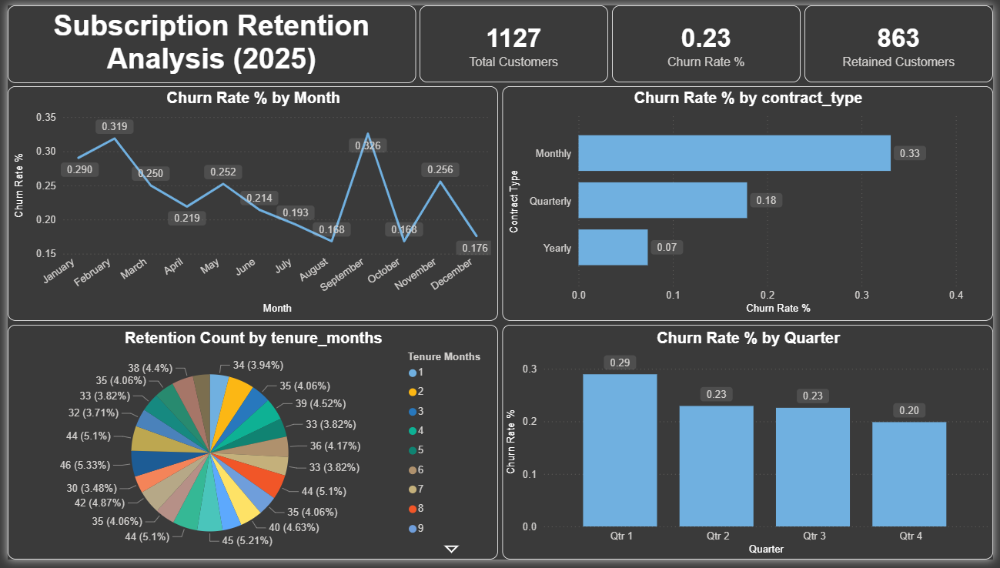

# Subscription Retention Analysis (Churn Prediction)
An end-to-end data science project focused on analyzing customer churn in a subscription-based business, identifying high-risk customers, and providing actionable retention insights using classical machine learning and business analytics.

## 1. Business Problem
Subscription-based companies lose recurring revenue when customers cancel their subscriptions (churn).  
The challenge is not only predicting churn, but understanding:
- Who is likely to churn?
- When do customers churn?
- Why does churn happen?
- How can the business act before churn occurs?
This project aims to solve these questions using data-driven analysis and interpretable machine learning.

## 2. Objective
- Analyze subscription customer behavior
- Identify churn patterns and retention cohorts
- Build a churn prediction model
- Convert model outputs into business actions
- Visualize insights using dashboards

**Target Variable:**  
- `churn` (1 = churned, 0 = retained)

## 3. Dataset Overview
- Synthetic - business-realistic dataset
- 1,200 customer records
- Semi-messy data with missing values to simulate real-world conditions

### Key Features
- Subscription start date
- Tenure (months)
- Monthly charges
- Usage frequency
- Support tickets (Feedback)
- Contract type
- Payment method
- Auto-renew status
- Churn label

## 4. Project Workflow
This project follows a universal data science lifecycle:
1. Business Understanding  
2. Data Collection / Dataset Generation  
3. Database Design & SQL Analysis  
4. Data Cleaning & Exploratory Data Analysis (EDA)  
5. Feature Engineering  
6. Model Building (Logistic Regression)  
7. Model Evaluation & Business Insights  
8. Visualization & Dashboard (Power BI)  
9. Documentation & GitHub Readiness  

## 5. Folder Structure
subscription-retention-analysis/  
│  
├── data/  
│   ├── raw/  
│   │   └── subscription_churn_raw.csv  
│   └── processed/  
│       ├── subscription_churn_clean.csv  
│       ├── X_features.csv  
│       └── y_target.csv  
│  
├── notebooks/  
│   └── eda_and_cleaning.ipynb  
│  
├── src/  
│   ├── feature_engineering.py  
│   ├── dataset_generation.py  
│   └── model_training.py  
│  
├── sql/  
│   ├── schema.sql  
│   └── churn_analysis_queries.sql  
│   └── assests/  
│       └── queries_result.txt  
│  
├── dashboards/  
│   ├── subcription_retention_analysis.png  
│   └── churn_dashboard.pbix  
│  
├── models/  
│   └── logistic_churn_model.pkl  
│  
├── subscription_retention_analysis_dashboard.png  
│  
├── README.md  
└── requirements.txt  

## 6. Data Cleaning & EDA
- Handled missing values using median and logical defaults
- Performed univariate and bivariate analysis
- Identified churn patterns based on:
  - Usage frequency
  - Contract type
  - Support tickets
- Prepared cohort-based retention foundations

## 7. Feature Engineering
- Date-based features (start month, start year)
- Tenure bucketing
- One-hot encoding for categorical variables
- Feature scaling for numerical columns
- Removed non-ML features (cohort identifiers)

## 8. Model Building
- Model Used: Logistic Regression
- Reason:
  - Interpretable
  - Suitable for binary classification
  - Business-friendly coefficient explanation
- Train-test split with stratification
- Probability-based churn prediction
- Risk segmentation based on churn probability

## 9. Model Evaluation
Evaluation focused on **business cost**, not just accuracy.

### Metrics Used:
- Accuracy
- Precision
- Recall (priority metric)
- F1-score
- Confusion Matrix

### Key Consideration:
Missing a churned customer (False Negative) is more costly than offering retention incentives to a loyal customer.

## 10. Key Business Insights
- Low usage frequency is the strongest indicator of churn
- Monthly subscriptions have higher churn than yearly plans
- Customers raising multiple support tickets are more likely to churn
- Auto-renew significantly reduces churn risk
- Threshold tuning improves business outcomes

## 11. Visualization & Dashboard
A Power BI dashboard was created to communicate insights:
- Overall churn rate
- Monthly churn trends
- Cohort-based retention heatmap
- Churn risk segmentation
- Contract-wise churn analysis
The dashboard enables business teams to monitor churn and take proactive actions.

## 12. Tech Stack Used
- Python (Pandas, NumPy, Scikit-learn)
- Machile Learning (Logistic Regression)
- SQL (MySQL)
- Statistics & Mathematics
- Power BI
- Git & GitHub

## 13. Business Impact
This project helps organizations to:
- Reduce churn-related revenue loss
- Identify high-risk customers early
- Design targeted retention strategies
- Make data-driven subscription decisions

## 14. How to Run the Project (Local)
1. Place the project folder on your local machine
2. Install dependencies using `requirements.txt`
3. Run preprocessing and feature engineering scripts
4. Train the model using `model_training.py`
5. Open Power BI dashboard file to explore insights

## 15. Author
**Harshad Dhongade**  
Master’s Student – Computer Application  
Aspiring Data Scientist / Data Analyst / ML Engineer
## 16. Future Improvements
- Try tree-based models for comparison
- Automate data pipeline
- Add cost-sensitive optimization
- Extend analysis to revenue-based churn
